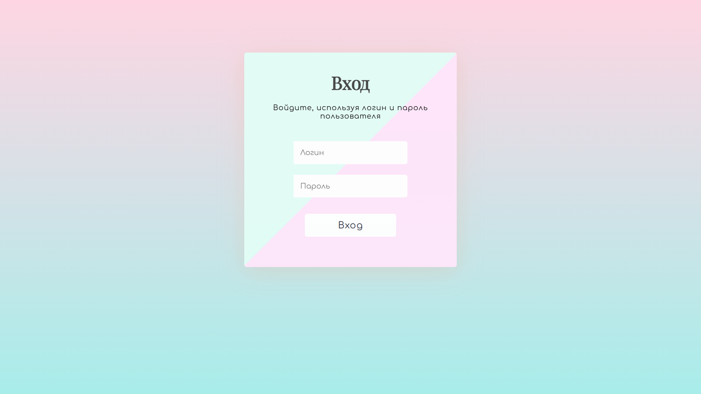
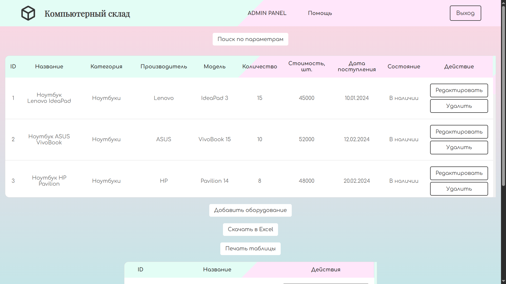

# warehouse
Система автоматизации складского учета и управления товарными позициями.
Разработано для структурирования хранения данных, упрощения инвентаризации и повышения прозрачности складских операций.

## Основной функционал
Учет товаров: Ведение базы данных складских позиций с возможностью добавления, редактирования и удаления записей.
Контроль остатков: Отслеживание количества продукции, фиксация поступлений и списаний.
Работа с таблицами: Структурированное хранение данных и удобный поиск необходимой информации.
Оптимизация процессов: Снижение ошибок при ручном учете и ускорение обработки складских операций.

## Технологический стек
Язык программирования: С#
База данных: SQL
Архитектура: Настольное приложение / клиент-серверная модель (в зависимости от реализации проекта)

## Назначение
ПО позволяет заменить ручной учет складских операций, минимизировать риск потери данных и ускорить процесс поиска и обработки информации о товарах.

## Установка и запуск
1. Откройте проект в среде разработки (например, Visual Studio).
2. Настройте строку подключения к базе данных в конфигурационном файле.
3. Выполните сборку и запустите приложение.

## Скриншоты

Страница входа

Главная страница

